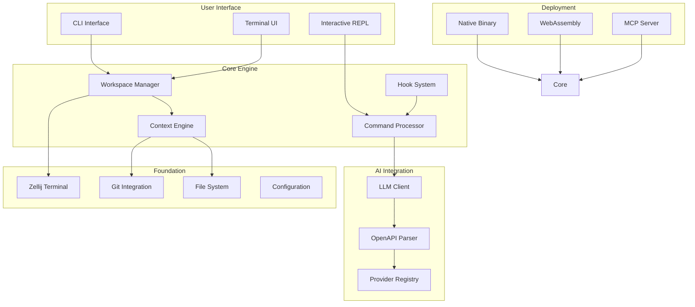
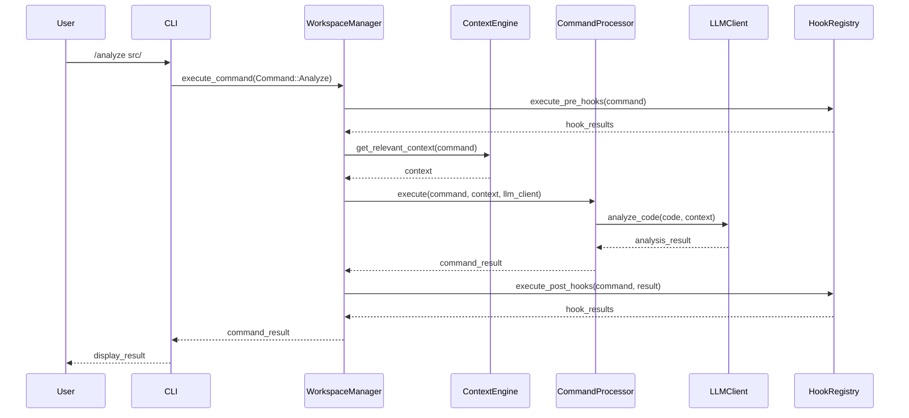
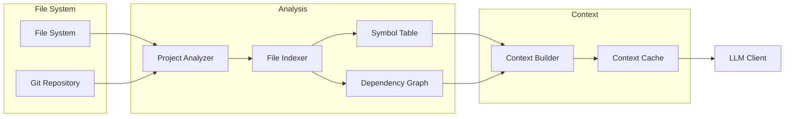
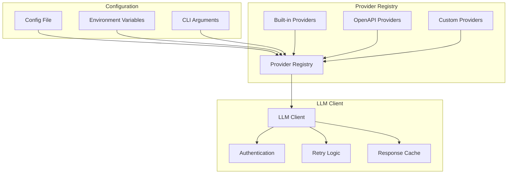

# PiCode Architecture Documentation

This document provides a comprehensive overview of PiCode's architecture, design decisions, and implementation details.

## Table of Contents

1. [System Overview](#system-overview)
2. [Core Architecture](#core-architecture)  
3. [Component Design](#component-design)
4. [Data Flow](#data-flow)
5. [Integration Layers](#integration-layers)
6. [Performance Considerations](#performance-considerations)
7. [Security Architecture](#security-architecture)
8. [Deployment Models](#deployment-models)

## System Overview

PiCode is a terminal-native AI workspace built on a modular, extensible architecture. The system is designed around three core principles:

1. **Terminal-Native**: Deep integration with terminal workflows
2. **Provider-Agnostic**: Support for any OpenAPI-compatible LLM
3. **Cross-Platform**: Native binary, WebAssembly, and MCP server deployment

### High-Level Architecture



## Core Architecture

### Workspace Manager

The Workspace Manager is the central orchestrator that coordinates all system components:

```rust
pub struct WorkspaceManager {
    config: Arc<Config>,
    context_engine: ContextEngine,
    command_processor: CommandProcessor,
    llm_client: LLMClient,
    hook_registry: HookRegistry,
    terminal_manager: TerminalManager,
}

impl WorkspaceManager {
    pub async fn initialize(config: Config) -> Result<Self> {
        let context_engine = ContextEngine::new(&config).await?;
        let llm_client = LLMClient::from_config(&config).await?;
        let hook_registry = HookRegistry::load_from_config(&config)?;
        let terminal_manager = TerminalManager::initialize().await?;
        
        Ok(Self {
            config: Arc::new(config),
            context_engine,
            command_processor: CommandProcessor::new(),
            llm_client,
            hook_registry,
            terminal_manager,
        })
    }
    
    pub async fn execute_command(&mut self, command: Command) -> Result<CommandResult> {
        // Pre-execution hooks
        self.hook_registry.execute_pre_hooks(&command).await?;
        
        // Command processing with context
        let context = self.context_engine.get_relevant_context(&command).await?;
        let result = self.command_processor.execute(command, context, &self.llm_client).await?;
        
        // Post-execution hooks
        self.hook_registry.execute_post_hooks(&command, &result).await?;
        
        Ok(result)
    }
}
```

### Context Engine

The Context Engine maintains project understanding and provides relevant context to LLM operations:

```rust
pub struct ContextEngine {
    project_analyzer: ProjectAnalyzer,
    file_index: FileIndex,
    symbol_table: SymbolTable,
    dependency_graph: DependencyGraph,
    git_context: GitContext,
    cache: Arc<RwLock<ContextCache>>,
}

impl ContextEngine {
    pub async fn analyze_project(&mut self, path: &Path) -> Result<ProjectAnalysis> {
        let project_type = self.project_analyzer.detect_project_type(path).await?;
        
        // Build file index
        self.file_index.index_directory(path, &project_type.include_patterns).await?;
        
        // Extract symbols and build dependency graph
        let files = self.file_index.get_indexed_files();
        for file in files {
            let symbols = self.extract_symbols(&file).await?;
            self.symbol_table.add_symbols(file.path(), symbols);
            
            let deps = self.extract_dependencies(&file).await?;
            self.dependency_graph.add_dependencies(file.path(), deps);
        }
        
        // Analyze Git context
        self.git_context.analyze_repository(path).await?;
        
        Ok(ProjectAnalysis {
            project_type,
            file_count: self.file_index.len(),
            symbol_count: self.symbol_table.len(),
            dependency_count: self.dependency_graph.len(),
            git_status: self.git_context.get_status(),
        })
    }
    
    pub async fn get_relevant_context(&self, command: &Command) -> Result<Context> {
        let mut context = Context::new();
        
        match command {
            Command::Analyze { path, .. } => {
                context.add_files(self.get_files_in_path(path).await?);
                context.add_dependencies(self.get_dependencies_for_path(path).await?);
            },
            Command::Edit { file, .. } => {
                context.add_file(self.file_index.get_file(file)?);
                context.add_related_files(self.get_related_files(file).await?);
                context.add_symbols(self.symbol_table.get_symbols_in_file(file));
            },
            // ... other command types
        }
        
        Ok(context)
    }
}
```

### Command Processor

The Command Processor handles slash command parsing and execution:

```rust
pub struct CommandProcessor {
    parsers: HashMap<String, Box<dyn CommandParser>>,
    executors: HashMap<String, Box<dyn CommandExecutor>>,
}

impl CommandProcessor {
    pub fn new() -> Self {
        let mut processor = Self {
            parsers: HashMap::new(),
            executors: HashMap::new(),
        };
        
        // Register built-in commands
        processor.register_command("analyze", AnalyzeParser::new(), AnalyzeExecutor::new());
        processor.register_command("edit", EditParser::new(), EditExecutor::new());
        processor.register_command("test", TestParser::new(), TestExecutor::new());
        // ... register all commands
        
        processor
    }
    
    pub async fn execute(
        &self, 
        command: Command, 
        context: Context, 
        llm_client: &LLMClient
    ) -> Result<CommandResult> {
        let executor = self.executors.get(&command.name())
            .ok_or_else(|| Error::UnknownCommand(command.name().to_string()))?;
            
        executor.execute(command, context, llm_client).await
    }
}

#[async_trait]
pub trait CommandExecutor: Send + Sync {
    async fn execute(
        &self,
        command: Command,
        context: Context,
        llm_client: &LLMClient,
    ) -> Result<CommandResult>;
}
```

## Component Design

### LLM Integration Layer

The LLM integration layer provides a unified interface to multiple AI providers:

```rust
#[async_trait]
pub trait LLMProvider: Send + Sync {
    async fn complete(&self, request: CompletionRequest) -> Result<CompletionResponse>;
    async fn chat(&self, messages: Vec<ChatMessage>) -> Result<ChatResponse>;
    async fn function_call(&self, functions: Vec<Function>, messages: Vec<ChatMessage>) -> Result<FunctionCallResponse>;
    fn supports_streaming(&self) -> bool;
    fn max_context_tokens(&self) -> usize;
    fn supported_functions(&self) -> Vec<FunctionCapability>;
}

pub struct LLMClient {
    active_provider: Box<dyn LLMProvider>,
    provider_registry: ProviderRegistry,
    config: LLMConfig,
}

impl LLMClient {
    pub async fn from_config(config: &Config) -> Result<Self> {
        let mut registry = ProviderRegistry::new();
        
        // Register built-in providers
        registry.register("openai", OpenAIProvider::new(&config.openai)?);
        registry.register("anthropic", AnthropicProvider::new(&config.anthropic)?);
        
        // Register custom providers from OpenAPI specs
        for (name, spec) in &config.custom_providers {
            let provider = OpenAPIProvider::from_spec(name, spec).await?;
            registry.register(name, provider);
        }
        
        let active_provider = registry.get(&config.default_provider)?;
        
        Ok(Self {
            active_provider,
            provider_registry: registry,
            config: config.llm.clone(),
        })
    }
    
    pub async fn switch_provider(&mut self, provider_name: &str) -> Result<()> {
        self.active_provider = self.provider_registry.get(provider_name)?;
        Ok(())
    }
}
```

### OpenAPI Provider Implementation

Dynamic provider creation from OpenAPI specifications:

```rust
pub struct OpenAPIProvider {
    client: reqwest::Client,
    base_url: Url,
    spec: OpenAPISpec,
    auth: AuthMethod,
    functions: Vec<Function>,
}

impl OpenAPIProvider {
    pub async fn from_spec(name: &str, spec_url: &str) -> Result<Self> {
        let spec_content = reqwest::get(spec_url).await?.text().await?;
        let spec: OpenAPISpec = serde_json::from_str(&spec_content)?;
        
        // Extract authentication method
        let auth = Self::extract_auth_method(&spec)?;
        
        // Generate function definitions from paths
        let functions = Self::extract_functions_from_paths(&spec)?;
        
        Ok(Self {
            client: reqwest::Client::new(),
            base_url: spec.servers.first()
                .map(|s| s.url.parse())
                .transpose()?
                .unwrap_or_else(|| "https://api.example.com".parse().unwrap()),
            spec,
            auth,
            functions,
        })
    }
    
    fn extract_functions_from_paths(spec: &OpenAPISpec) -> Result<Vec<Function>> {
        let mut functions = Vec::new();
        
        for (path, path_item) in &spec.paths {
            for (method, operation) in path_item.operations() {
                if let Some(operation) = operation {
                    let function = Function {
                        name: operation.operation_id.clone()
                            .unwrap_or_else(|| format!("{}_{}", method, path.trim_start_matches('/'))),
                        description: operation.summary.clone()
                            .or_else(|| operation.description.clone()),
                        parameters: Self::extract_parameters(&operation.parameters)?,
                        response_schema: Self::extract_response_schema(&operation.responses)?,
                    };
                    functions.push(function);
                }
            }
        }
        
        Ok(functions)
    }
}

#[async_trait]
impl LLMProvider for OpenAPIProvider {
    async fn function_call(
        &self, 
        functions: Vec<Function>, 
        messages: Vec<ChatMessage>
    ) -> Result<FunctionCallResponse> {
        // Find the chat completion endpoint in the OpenAPI spec
        let completion_path = self.find_completion_endpoint()?;
        
        let request_body = json!({
            "messages": messages,
            "functions": functions,
            "function_call": "auto"
        });
        
        let response = self.client
            .post(&format!("{}{}", self.base_url, completion_path))
            .header("Authorization", self.auth.to_header()?)
            .json(&request_body)
            .send()
            .await?;
            
        let response_data: serde_json::Value = response.json().await?;
        Ok(FunctionCallResponse::from_json(response_data)?)
    }
}
```

### Zellij Integration

Integration with Zellij terminal multiplexer:

```rust
pub struct ZellijPlugin {
    workspace_manager: Arc<Mutex<WorkspaceManager>>,
    pane_manager: PaneManager,
    layout_manager: LayoutManager,
}

impl ZellijPlugin {
    pub fn load() -> Self {
        let config = Config::load_from_zellij_context();
        let workspace_manager = Arc::new(Mutex::new(
            WorkspaceManager::initialize(config).expect("Failed to initialize workspace")
        ));
        
        Self {
            workspace_manager,
            pane_manager: PaneManager::new(),
            layout_manager: LayoutManager::new(),
        }
    }
}

impl ZellijPluginInterface for ZellijPlugin {
    fn load(&mut self) {
        // Initialize UI layout
        self.layout_manager.set_layout("default");
        self.pane_manager.create_panes(&[
            PaneConfig::new("file_explorer", PaneType::FileExplorer),
            PaneConfig::new("ai_assistant", PaneType::AIAssistant),
            PaneConfig::new("terminal", PaneType::Terminal),
        ]);
        
        // Register event handlers
        subscribe(&[EventType::Key, EventType::Mouse, EventType::Pane]);
    }
    
    fn update(&mut self, event: Event) -> bool {
        match event {
            Event::Key(key_event) => self.handle_key_event(key_event),
            Event::Mouse(mouse_event) => self.handle_mouse_event(mouse_event),
            Event::Pane(pane_event) => self.handle_pane_event(pane_event),
        }
    }
    
    fn render(&mut self, rows: usize, cols: usize) {
        // Render file explorer pane
        if let Some(pane) = self.pane_manager.get_pane("file_explorer") {
            let file_tree = self.build_file_tree();
            pane.render_text(&file_tree);
        }
        
        // Render AI assistant pane
        if let Some(pane) = self.pane_manager.get_pane("ai_assistant") {
            let conversation = self.get_conversation_history();
            pane.render_conversation(&conversation);
        }
        
        // Render terminal pane (handled by Zellij)
    }
}
```

### Hook System Architecture

Extensible hook system for workflow customization:

```rust
pub struct HookRegistry {
    hooks: HashMap<HookType, Vec<Box<dyn Hook>>>,
    config: HookConfig,
}

#[async_trait]
pub trait Hook: Send + Sync {
    async fn execute(&self, context: &HookContext) -> Result<HookResult>;
    fn priority(&self) -> i32 { 0 }
    fn enabled(&self) -> bool { true }
}

#[derive(Debug, Clone)]
pub enum HookType {
    PreEdit,
    PostEdit,
    PreCommit,
    PostCommit,
    PrePush,
    PostPush,
    PreAnalyze,
    PostAnalyze,
    Custom(String),
}

pub struct HookContext {
    pub command: Command,
    pub file_path: Option<PathBuf>,
    pub workspace: Arc<WorkspaceManager>,
    pub metadata: HashMap<String, serde_json::Value>,
}

impl HookRegistry {
    pub fn register_hook(&mut self, hook_type: HookType, hook: Box<dyn Hook>) {
        self.hooks.entry(hook_type).or_default().push(hook);
    }
    
    pub async fn execute_hooks(&self, hook_type: HookType, context: &HookContext) -> Result<Vec<HookResult>> {
        let hooks = self.hooks.get(&hook_type).unwrap_or(&Vec::new());
        let mut results = Vec::new();
        
        // Sort hooks by priority
        let mut sorted_hooks: Vec<_> = hooks.iter().filter(|h| h.enabled()).collect();
        sorted_hooks.sort_by_key(|h| h.priority());
        
        // Execute hooks in order
        for hook in sorted_hooks {
            match hook.execute(context).await {
                Ok(result) => {
                    results.push(result);
                    // Stop if hook indicates abort
                    if result.should_abort() {
                        break;
                    }
                },
                Err(e) => {
                    if self.config.fail_on_hook_error {
                        return Err(e);
                    } else {
                        tracing::warn!("Hook failed: {}", e);
                    }
                }
            }
        }
        
        Ok(results)
    }
}
```

## Data Flow

### Command Processing Flow



### Context Building Flow



### Provider Integration Flow



## Integration Layers

### Terminal Integration

PiCode integrates deeply with terminal environments through multiple layers:

1. **Zellij Plugin Layer**: WASM-based plugin for Zellij terminal multiplexer
2. **Standalone CLI**: Independent binary that can run in any terminal
3. **Shell Integration**: Hooks into shell history and environment

```rust
pub enum TerminalMode {
    ZellijPlugin,
    Standalone,
    Embedded,
}

pub struct TerminalManager {
    mode: TerminalMode,
    interface: Box<dyn TerminalInterface>,
}

#[async_trait]
pub trait TerminalInterface: Send + Sync {
    async fn initialize(&mut self) -> Result<()>;
    async fn render(&mut self, content: &RenderContent) -> Result<()>;
    async fn handle_input(&mut self) -> Result<InputEvent>;
    async fn cleanup(&mut self) -> Result<()>;
}
```

### Git Integration

Deep integration with Git for version control awareness:

```rust
pub struct GitContext {
    repository: git2::Repository,
    status_cache: Arc<RwLock<Option<GitStatus>>>,
    diff_analyzer: DiffAnalyzer,
}

impl GitContext {
    pub async fn analyze_changes(&self, since: Option<&str>) -> Result<ChangeAnalysis> {
        let diff = if let Some(commit) = since {
            self.repository.diff_tree_to_workdir_with_index(
                self.repository.find_commit(
                    &self.repository.revparse_single(commit)?.id()
                )?.tree()?,
                None
            )?
        } else {
            self.repository.diff_index_to_workdir(None, None)?
        };
        
        let mut analysis = ChangeAnalysis::new();
        
        diff.foreach(
            &mut |delta, _| {
                analysis.add_file_change(FileChange {
                    path: delta.new_file().path().unwrap().to_path_buf(),
                    change_type: delta.status().into(),
                    lines_added: 0, // Will be filled by hunk callback
                    lines_removed: 0,
                });
                true
            },
            None,
            Some(&mut |_delta, _hunk| {
                // Analyze hunk for complexity and impact
                true
            }),
            Some(&mut |_delta, _hunk, line| {
                match line.origin() {
                    '+' => analysis.increment_additions(),
                    '-' => analysis.increment_deletions(),
                    _ => {}
                }
                true
            }),
        )?;
        
        Ok(analysis)
    }
    
    pub fn get_intelligent_commit_message(&self, changes: &ChangeAnalysis) -> Result<String> {
        // Analyze changes and generate conventional commit message
        let commit_type = self.infer_commit_type(changes);
        let scope = self.infer_scope(changes);
        let description = self.generate_description(changes);
        
        Ok(format!("{}({}): {}", commit_type, scope, description))
    }
}
```

### File System Integration

Efficient file system operations with caching and watching:

```rust
pub struct FileSystemManager {
    watcher: notify::RecommendedWatcher,
    index: Arc<RwLock<FileIndex>>,
    cache: Arc<RwLock<FileCache>>,
    ignore_patterns: Vec<glob::Pattern>,
}

impl FileSystemManager {
    pub async fn watch_directory(&mut self, path: &Path) -> Result<()> {
        let (tx, rx) = mpsc::channel();
        
        self.watcher = notify::watcher(tx, Duration::from_secs(1))?;
        self.watcher.watch(path, RecursiveMode::Recursive)?;
        
        // Handle file system events
        tokio::spawn(async move {
            while let Ok(event) = rx.recv() {
                match event {
                    DebouncedEvent::Create(path) => {
                        self.handle_file_created(&path).await;
                    },
                    DebouncedEvent::Write(path) => {
                        self.handle_file_modified(&path).await;
                    },
                    DebouncedEvent::Remove(path) => {
                        self.handle_file_deleted(&path).await;
                    },
                    _ => {}
                }
            }
        });
        
        Ok(())
    }
    
    async fn handle_file_modified(&self, path: &Path) {
        // Invalidate cache for this file
        self.cache.write().await.remove(path);
        
        // Re-index if it's a source file
        if self.is_source_file(path) {
            if let Ok(content) = tokio::fs::read_to_string(path).await {
                self.index.write().await.update_file(path, content);
            }
        }
        
        // Notify context engine of changes
        // This could trigger re-analysis or context updates
    }
}
```

## Performance Considerations

### Caching Strategy

Multi-level caching for optimal performance:

```rust
pub struct CacheManager {
    file_cache: Arc<RwLock<LruCache<PathBuf, FileContent>>>,
    analysis_cache: Arc<RwLock<LruCache<AnalysisKey, AnalysisResult>>>,
    llm_cache: Arc<RwLock<LruCache<LLMRequest, LLMResponse>>>,
    context_cache: Arc<RwLock<LruCache<ContextKey, Context>>>,
}

impl CacheManager {
    pub async fn get_or_compute_analysis<F, Fut>(
        &self,
        key: AnalysisKey,
        compute_fn: F,
    ) -> Result<AnalysisResult>
    where
        F: FnOnce() -> Fut,
        Fut: Future<Output = Result<AnalysisResult>>,
    {
        // Try cache first
        if let Some(cached) = self.analysis_cache.read().await.get(&key) {
            return Ok(cached.clone());
        }
        
        // Compute if not cached
        let result = compute_fn().await?;
        
        // Store in cache
        self.analysis_cache.write().await.put(key, result.clone());
        
        Ok(result)
    }
}
```

### Async Architecture

Fully async architecture for non-blocking operations:

```rust
pub struct AsyncWorkspaceManager {
    task_pool: tokio::task::JoinSet<TaskResult>,
    background_tasks: Arc<Mutex<Vec<tokio::task::JoinHandle<()>>>>,
    task_queue: Arc<Mutex<VecDeque<Task>>>,
}

impl AsyncWorkspaceManager {
    pub async fn execute_command_async(&mut self, command: Command) -> Result<TaskHandle> {
        let task_id = Uuid::new_v4();
        
        let task = Task {
            id: task_id,
            command,
            priority: TaskPriority::Normal,
            created_at: Instant::now(),
        };
        
        // Add to queue
        self.task_queue.lock().await.push_back(task);
        
        // Spawn background worker if needed
        self.ensure_workers_running().await?;
        
        Ok(TaskHandle { task_id })
    }
    
    async fn process_task_queue(&mut self) {
        while let Some(task) = self.task_queue.lock().await.pop_front() {
            let handle = tokio::spawn(async move {
                // Execute task with timeout
                let result = tokio::time::timeout(
                    Duration::from_secs(300),
                    self.execute_task(task)
                ).await;
                
                match result {
                    Ok(Ok(task_result)) => task_result,
                    Ok(Err(e)) => TaskResult::Error(e),
                    Err(_) => TaskResult::Timeout,
                }
            });
            
            self.task_pool.spawn(handle);
        }
    }
}
```

### Memory Management

Efficient memory usage patterns:

```rust
pub struct MemoryManager {
    heap_monitor: HeapMonitor,
    gc_scheduler: GCScheduler,
    memory_pools: HashMap<String, MemoryPool>,
}

impl MemoryManager {
    pub fn monitor_memory_usage(&self) -> MemoryStats {
        MemoryStats {
            heap_size: self.heap_monitor.current_heap_size(),
            allocated: self.heap_monitor.allocated_bytes(),
            rss: self.heap_monitor.resident_set_size(),
            cache_usage: self.calculate_cache_usage(),
        }
    }
    
    pub async fn optimize_memory(&mut self) {
        // Trigger garbage collection if memory usage is high
        if self.memory_usage_percentage() > 80.0 {
            self.gc_scheduler.trigger_collection().await;
        }
        
        // Clear old cache entries
        self.clear_expired_cache_entries().await;
        
        // Compact memory pools
        for pool in self.memory_pools.values_mut() {
            pool.compact().await;
        }
    }
}
```

## Security Architecture

### API Key Management

Secure handling of sensitive credentials:

```rust
pub struct SecureConfig {
    keyring: keyring::Keyring,
    encrypted_store: EncryptedStore,
    env_loader: EnvLoader,
}

impl SecureConfig {
    pub async fn load_api_key(&self, provider: &str) -> Result<String> {
        // Try keyring first
        if let Ok(key) = self.keyring.get_password("picode", &format!("{}_api_key", provider)) {
            return Ok(key);
        }
        
        // Try environment variable
        if let Ok(key) = std::env::var(&format!("{}_API_KEY", provider.to_uppercase())) {
            return Ok(key);
        }
        
        // Try encrypted configuration
        if let Some(key) = self.encrypted_store.get(&format!("{}.api_key", provider))? {
            return Ok(key);
        }
        
        Err(Error::ApiKeyNotFound(provider.to_string()))
    }
    
    pub async fn store_api_key(&mut self, provider: &str, key: &str) -> Result<()> {
        // Store in keyring for security
        self.keyring.set_password("picode", &format!("{}_api_key", provider), key)?;
        
        // Also store encrypted backup
        self.encrypted_store.set(&format!("{}.api_key", provider), key)?;
        
        Ok(())
    }
}
```

### Sandboxing

Secure execution environment for external operations:

```rust
pub struct SecurityManager {
    sandbox: Sandbox,
    permission_manager: PermissionManager,
    audit_logger: AuditLogger,
}

impl SecurityManager {
    pub async fn execute_safely<F, T>(&self, operation: F) -> Result<T>
    where
        F: FnOnce() -> Result<T> + Send + 'static,
        T: Send + 'static,
    {
        // Check permissions
        self.permission_manager.check_operation_allowed(&operation)?;
        
        // Log operation
        self.audit_logger.log_operation_start(&operation);
        
        // Execute in sandbox
        let result = self.sandbox.execute(operation).await;
        
        // Log result
        self.audit_logger.log_operation_end(&operation, &result);
        
        result
    }
}
```

## Deployment Models

### Native Binary

Standard Rust binary with system integration:

```toml
[features]
default = ["native", "zellij-plugin"]
native = ["tokio/full", "clap", "crossterm"]
minimal = ["tokio/rt"]
```

### WebAssembly

Browser and MCP server deployment:

```rust
#[cfg(feature = "wasm")]
mod wasm {
    use wasm_bindgen::prelude::*;
    
    #[wasm_bindgen]
    pub struct PiCodeWasm {
        workspace: WorkspaceManager,
    }
    
    #[wasm_bindgen]
    impl PiCodeWasm {
        #[wasm_bindgen(constructor)]
        pub fn new(config: JsValue) -> Result<PiCodeWasm, JsValue> {
            let config: Config = serde_wasm_bindgen::from_value(config)?;
            let workspace = WorkspaceManager::initialize(config)
                .map_err(|e| JsValue::from_str(&e.to_string()))?;
                
            Ok(PiCodeWasm { workspace })
        }
        
        #[wasm_bindgen]
        pub async fn execute_command(&mut self, command: JsValue) -> Result<JsValue, JsValue> {
            let command: Command = serde_wasm_bindgen::from_value(command)?;
            let result = self.workspace.execute_command(command).await
                .map_err(|e| JsValue::from_str(&e.to_string()))?;
            
            Ok(serde_wasm_bindgen::to_value(&result)?)
        }
    }
}
```

### MCP Server

Model Context Protocol server implementation:

```rust
pub struct MCPServer {
    workspace: Arc<Mutex<WorkspaceManager>>,
    server: axum::Server<hyper::server::conn::AddrIncoming, axum::routing::IntoMakeService<axum::Router>>,
}

impl MCPServer {
    pub async fn start(config: Config, addr: SocketAddr) -> Result<()> {
        let workspace = Arc::new(Mutex::new(WorkspaceManager::initialize(config).await?));
        
        let app = axum::Router::new()
            .route("/mcp/tools", axum::routing::get(list_tools))
            .route("/mcp/execute", axum::routing::post(execute_tool))
            .route("/mcp/status", axum::routing::get(server_status))
            .layer(axum::middleware::from_fn(auth_middleware))
            .with_state(workspace);
        
        let server = axum::Server::bind(&addr).serve(app.into_make_service());
        
        println!("MCP server listening on {}", addr);
        server.await?;
        
        Ok(())
    }
}

async fn execute_tool(
    State(workspace): State<Arc<Mutex<WorkspaceManager>>>,
    Json(request): Json<MCPToolRequest>,
) -> Result<Json<MCPToolResponse>, StatusCode> {
    let command = Command::from_mcp_request(request)?;
    let result = workspace.lock().await.execute_command(command).await
        .map_err(|_| StatusCode::INTERNAL_SERVER_ERROR)?;
    
    Ok(Json(MCPToolResponse::from_command_result(result)))
}
```

This architecture documentation provides a comprehensive view of PiCode's design and implementation. The modular, extensible design ensures maintainability while providing the flexibility needed for a universal AI development tool.