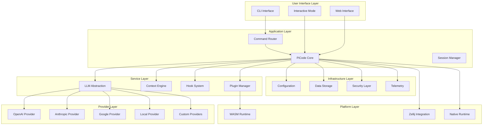
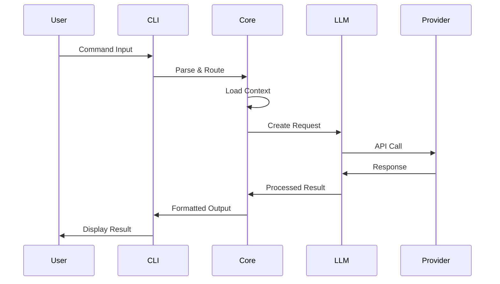
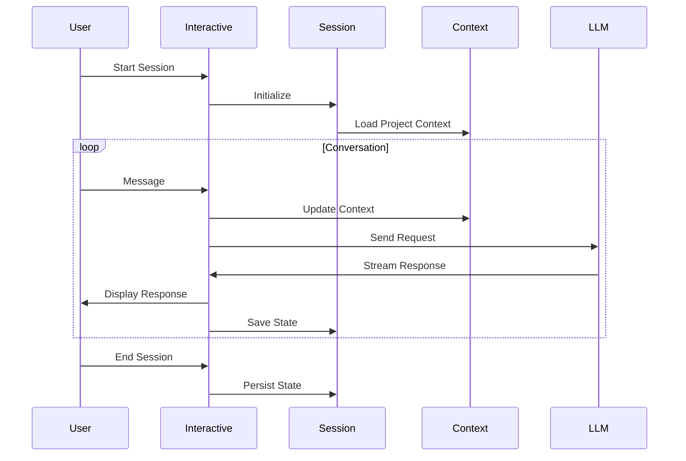
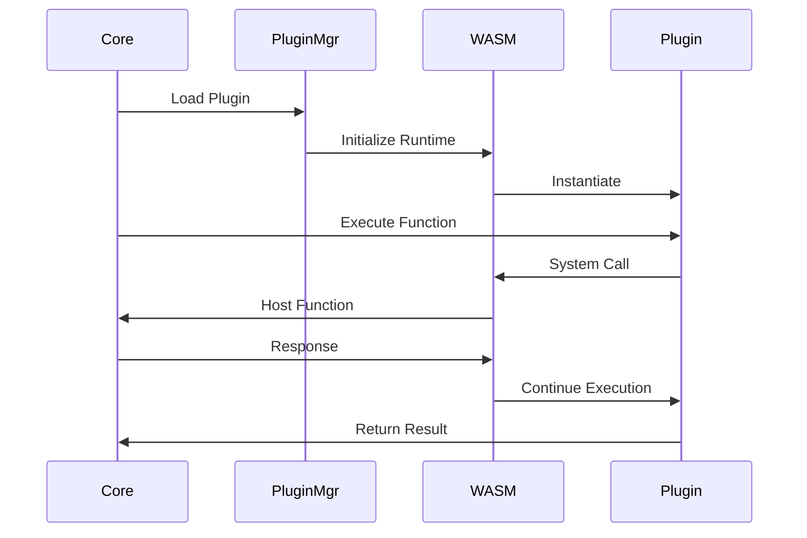

# PiCode Architecture

> 🏗️ **System Design Overview** - Core architecture and design principles

PiCode is built on a modular, extensible architecture that enables universal LLM integration while maintaining high performance and security.

## Architecture Overview

## Core Principles

### 1. **Universal LLM Support**
- Provider-agnostic abstraction layer
- OpenAPI specification compliance
- Dynamic client generation
- Unified interface for all providers

### 2. **Modular Architecture**
- Clear separation of concerns
- Plugin-based extensibility
- Trait-based abstractions
- Dependency injection patterns

### 3. **Security by Design**
- Sandboxed plugin execution
- Encrypted credential storage
- Input validation and sanitization
- Principle of least privilege

### 4. **Performance First**
- Zero-copy operations where possible
- Async-first architecture
- Memory-efficient data structures
- Optimized for large codebases

### 5. **Developer Experience**
- Comprehensive error messages
- Rich debugging information
- Extensive testing coverage
- Clear API documentation

## Component Architecture

### 🧠 [Core System](core.md)
The central orchestration engine
- **Command Processing**: CLI command parsing and routing
- **Session Management**: Interactive session state handling
- **Context Management**: Project and file context tracking
- **Error Handling**: Comprehensive error management
- **Configuration**: System-wide configuration management

### 🔌 [Plugin System](plugins.md)
Extensible WASM-based plugin architecture
- **Plugin Runtime**: WebAssembly execution environment
- **Host Interface**: Bindings for system interaction
- **Plugin Registry**: Discovery and management
- **Security Sandbox**: Controlled execution environment
- **Resource Management**: Memory and performance limits

### 🤖 [LLM Integration](llm-integration.md)
Universal language model provider support
- **Provider Abstraction**: Unified interface layer
- **Client Generation**: OpenAPI-based client creation
- **Authentication**: Multi-method auth support
- **Response Handling**: Streaming and batch processing
- **Error Recovery**: Robust error handling and retries

### 🔒 [Security Model](security.md)
Comprehensive security architecture
- **Credential Management**: Secure API key handling
- **Input Validation**: Request and response sanitization
- **Access Control**: Permission-based resource access
- **Audit Logging**: Security event tracking
- **Privacy Protection**: Data handling and retention

## System Architecture Layers

### User Interface Layer
**Responsibility**: User interaction and command input
- **CLI Interface**: Command-line argument parsing and execution
- **Interactive Mode**: Conversational interface with session management
- **Web Interface**: Browser-based interface (future)

### Application Layer
**Responsibility**: Core application logic and orchestration
- **Command Router**: Route commands to appropriate handlers
- **Session Manager**: Manage interactive sessions and state
- **Context Engine**: Project understanding and context management

### Service Layer
**Responsibility**: Business logic and feature implementation
- **LLM Abstraction**: Provider-agnostic language model interface
- **Hook System**: Pre/post operation extensibility
- **Plugin Manager**: WASM plugin lifecycle management

### Provider Layer
**Responsibility**: External service integration
- **OpenAI Provider**: GPT model integration
- **Anthropic Provider**: Claude model integration
- **Google Provider**: Gemini model integration
- **Local Provider**: Ollama and local model support

### Infrastructure Layer
**Responsibility**: System services and cross-cutting concerns
- **Configuration**: Multi-source configuration management
- **Storage**: Data persistence and caching
- **Security**: Authentication, authorization, encryption
- **Telemetry**: Monitoring, logging, and metrics

### Platform Layer
**Responsibility**: Runtime environment and deployment
- **Zellij Integration**: Terminal multiplexer integration
- **WASM Runtime**: WebAssembly execution environment
- **Native Runtime**: Direct system execution

## Data Flow Architecture

### Request Processing Flow

### Interactive Session Flow

### Plugin Execution Flow

## Integration Points

### Zellij Terminal Integration
- **Layout Management**: Multi-pane development interface
- **Session Persistence**: Detachable session support
- **Plugin System**: WASM plugin execution environment
- **Terminal Control**: Advanced terminal features

### Version Control Systems
- **Git Integration**: Branch analysis and commit assistance
- **Change Detection**: Automated change monitoring
- **Conflict Resolution**: AI-assisted merge conflict resolution
- **Commit Enhancement**: Intelligent commit message generation

### Development Tools
- **LSP Integration**: Language server protocol support
- **Formatter Integration**: Code formatting pipeline
- **Linter Integration**: Static analysis tool integration
- **Build System**: Integration with cargo, npm, etc.

### External Services
- **GitHub API**: Repository management and collaboration
- **GitLab API**: CI/CD pipeline integration
- **Slack/Discord**: Team notification integration
- **Issue Tracking**: Jira, GitHub Issues integration

## Scalability Considerations

### Performance Optimization
- **Caching Strategy**: Multi-level caching for contexts and responses
- **Parallel Processing**: Concurrent LLM request handling
- **Memory Management**: Efficient memory usage patterns
- **Background Tasks**: Non-blocking operation execution

### Resource Management
- **Connection Pooling**: Reuse HTTP connections to providers
- **Rate Limiting**: Respect provider API limits
- **Circuit Breakers**: Fault tolerance and recovery
- **Graceful Degradation**: Fallback mechanisms

### Deployment Flexibility
- **Multi-Platform**: Linux, macOS, Windows support
- **Container Support**: Docker and Kubernetes deployment
- **WASM Deployment**: Browser and edge execution
- **Cloud Integration**: AWS, GCP, Azure deployment options

## Future Architecture Evolution

### Planned Enhancements
- **Distributed Mode**: Multi-node coordination
- **Real-time Collaboration**: Shared development sessions
- **Advanced Analytics**: Usage and performance insights
- **Machine Learning**: Personalized assistance models

### Extension Points
- **Custom Providers**: Third-party LLM integration
- **Protocol Extensions**: New communication protocols
- **UI Frameworks**: Alternative user interfaces
- **Storage Backends**: Database and cloud storage options

---

**Next**: Explore detailed component documentation: [Core System](core.md) • [Plugin System](plugins.md) • [LLM Integration](llm-integration.md)