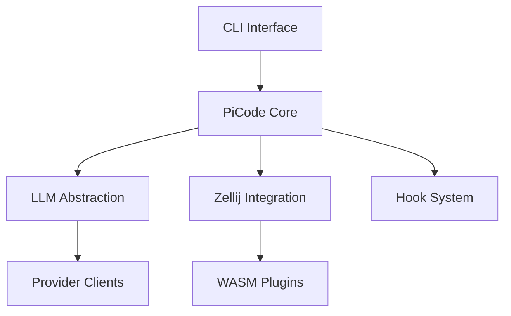

# Developer Documentation

> 🛠️ **Build and Extend PiCode** - Architecture, APIs, and contribution guidelines

This section provides comprehensive technical documentation for developers working on PiCode core, plugins, or integrations.

## Architecture Overview

PiCode follows a modular, plugin-based architecture built on Rust and Zellij foundations:



## Quick Navigation

### 🏗️ [Architecture](architecture/index.md)
System design and architectural decisions
- [Core Architecture](architecture/core.md)
- [Plugin System](architecture/plugins.md)
- [LLM Integration](architecture/llm-integration.md)
- [Security Model](architecture/security.md)

### 🔧 [Components](components/index.md)
Detailed component specifications
- [CLI Module](components/cli.md)
- [Core Engine](components/core.md)
- [Provider Registry](components/providers.md)
- [Hook Registry](components/hooks.md)

### 📡 [API Reference](api/index.md)
Internal APIs and interfaces
- [Core API](api/core.md)
- [Plugin API](api/plugins.md)
- [Provider Interface](api/providers.md)
- [Hook Interface](api/hooks.md)

### 🤝 [Contributing](contributing/index.md)
Guidelines for contributing to PiCode
- [Getting Started](contributing/setup.md)
- [Code Standards](contributing/standards.md)
- [Testing Guidelines](contributing/testing.md)
- [Documentation](contributing/documentation.md)

## Development Setup

### Prerequisites
```bash
# Rust toolchain (1.70+)
curl --proto '=https' --tlsv1.2 -sSf https://sh.rustup.rs | sh

# WASM target
rustup target add wasm32-wasi wasm32-unknown-unknown

# Development tools
cargo install wasm-pack cargo-watch
```

### Quick Start
```bash
# Clone the repository
git clone https://github.com/pnocera/PiCode.git
cd PiCode

# Run tests
cargo test

# Start development server
cargo run -- --dev
```

## Key Design Principles

### 1. **Modular Architecture**
- Clear separation of concerns
- Plugin-based extensibility
- Trait-based abstractions

### 2. **Performance First**
- Zero-copy where possible
- Async-first design
- Memory-efficient operations

### 3. **Developer Experience**
- Comprehensive error messages
- Rich debugging information
- Extensive testing coverage

### 4. **Security by Design**
- Sandboxed plugin execution
- Secure credential management
- Input validation and sanitization

## Technology Stack

### Core Technologies
- **Language**: Rust 2021 Edition
- **Async Runtime**: Tokio
- **CLI Framework**: Clap v4
- **Web Framework**: Axum
- **Database**: SQLite with SQLx

### Build and Deployment
- **WASM**: wasm-pack for WebAssembly compilation
- **Container**: Docker for containerized deployment
- **CI/CD**: GitHub Actions for automated testing
- **Documentation**: mdBook for developer docs

## Contributing Workflow

1. **Fork & Clone**: Fork the repository and clone locally
2. **Branch**: Create a feature branch from `main`
3. **Develop**: Follow TDD practices with comprehensive tests
4. **Test**: Ensure all tests pass and coverage requirements met
5. **Document**: Update relevant documentation
6. **Submit**: Open a pull request with clear description

## Community Standards

### Code Review Process
- All changes require peer review
- Automated checks must pass
- Documentation updates required for API changes
- Performance impact assessment for core changes

### Communication Channels
- 💬 [Developer Discussions](https://github.com/pnocera/PiCode/discussions/categories/development)
- 📧 [Developer Mailing List](mailto:dev@picode.dev)
- 🗨️ [Discord Server](https://discord.gg/picode-dev)

---

**Next Steps**: Review the [Architecture Overview](architecture/core.md) or set up your [Development Environment](contributing/setup.md).